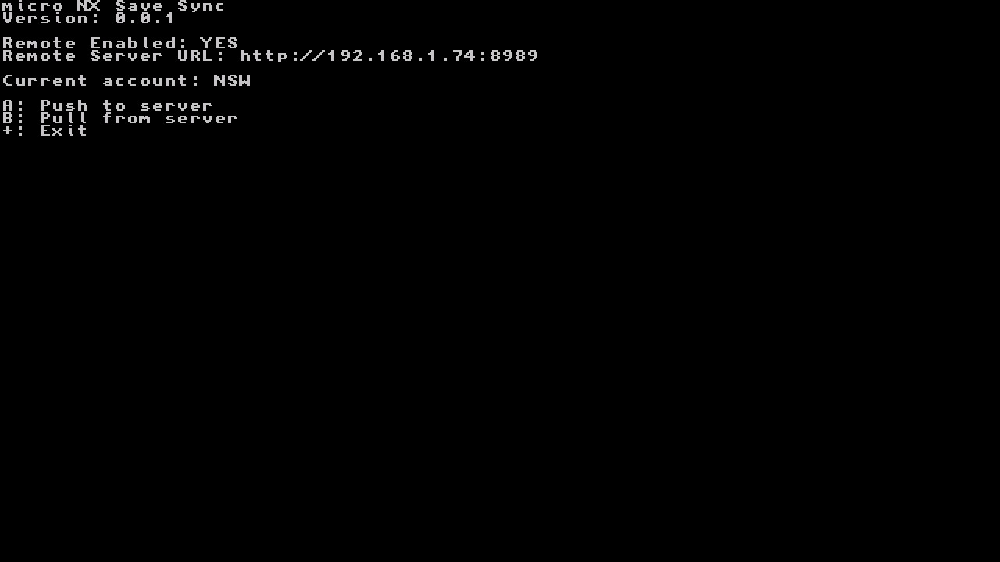

# uNX Save Sync
uNX Save Sync (aka. uNSS) is a Nintendo Switch application that allows synchronization of save data between multiple devices through a central remote server.

central remote server manages save data with internal revision IDs for each user and title.

# Usages
## Client

* How save data to push to remote? __JUST PRESS `A` BUTTON__.
* How save data to pull from remote? __JUST PRESS `B` BUTTON__.

### Configuration
To use remote server synchronization, you must configure settings first. and uNSS client reads settings from `sdmc:/uNSS/config.ini`

```ini
[remote]
enabled=1
serverUrl=http://your.hostname.com:8989
```

## Server
### Prerequisite
Running server via Python interpreter requires some dependencies. Install dependencies first.
```bash
pip install -r requirements.txt
```

### Linux / macOS
Background mode
```bash
nohup run-linux.sh
```

Foreground mode

```bash
./run-linux.sh
```

or

```bash
python main.py --host 0.0.0.0 --port 8989
```

### Windows
Just used prebuilt binary by PyInstaller


# Limitations
Save file restoration only works if the game has saved at least once
